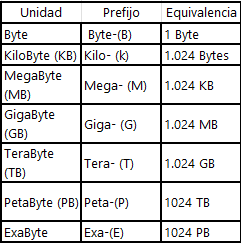

1.   
Los datos en una computadora se representan utilizando patrones de bits, que son secuencias de ceros y unos.   
Números: Usando el sistema binario directo o complemento a dos para enteros negativos.  
Letras: Utilizando códigos como ASCII/Unicode que asigna un patrón único por carácter.  
Imágenes: Matrices de pixeles con valores específicos según el color necesario.  
Audio: Muestras numéricas regulares capturadas desde señales analógicas convertidas luego digitalmente guardadas bajo formatos especializados tipo WAV/MP3.  

[https://www.oposinet.com/temario-de-informatica/temario-3-informatica/tema-10-representacin-interna-de-los-datos-2/]  

2. 
    Cada variable binaria puede tener dos estados: 0 o 1. Por lo tanto, si tenemos N variables binarias, el número total de estados posibles es igual a 2^N.  

 3.   
   

 4.   
 El trabajo de George Boole es fundamental debido a su desarrollo del álgebra booleana, que permite expresar operaciones lógicas mediante variables binarias (verdadero/falso o 0/1). Esto ha sido crucial para el diseño de circuitos digitales y sistemas informáticos modernos, sentando las bases para la computación contemporánea.   

 [https://www.eurekando.org/biografias/biografia-de-george-boole-teoria-del-algebra-booleana/]
