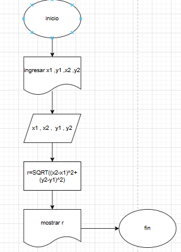
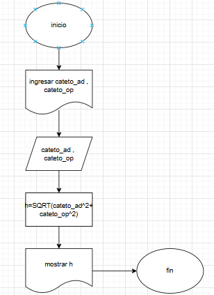
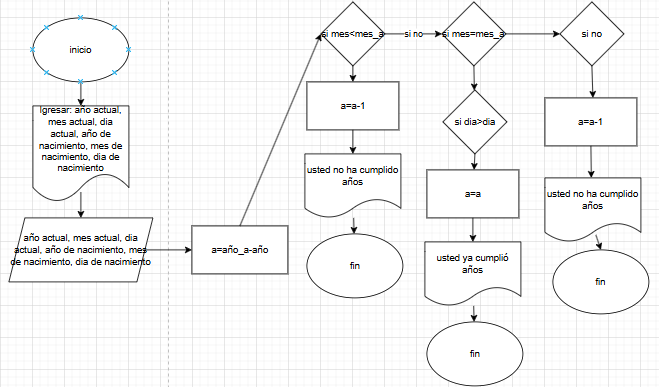
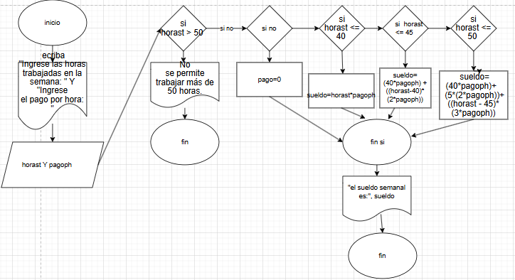
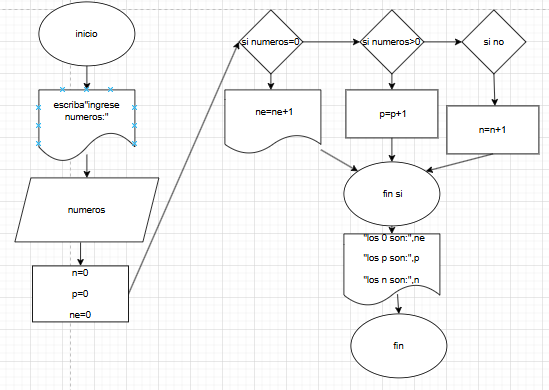
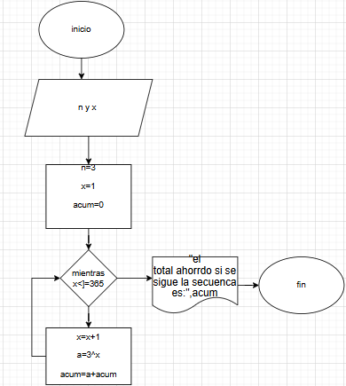
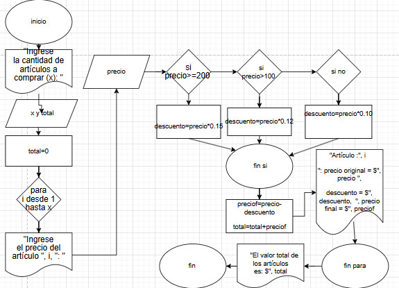
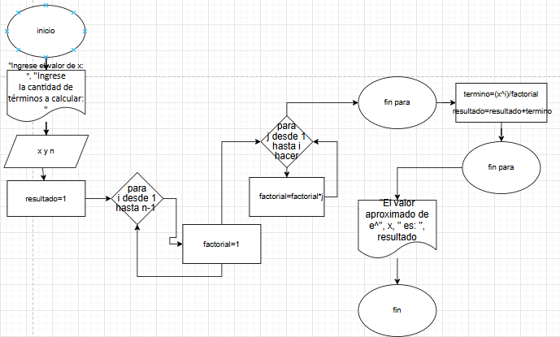
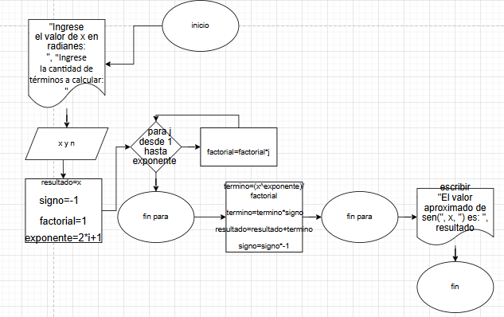

1.  
Analisis:  
Pedir las distancias y con estas realizar con la formua para hallar la distancia.  

Diagrama de flujo:


Pseudocodigo: 
```
inicio
escriba" x1 , y1"
leer x1 , y1
escriba" x2 , y2"
leer x2 , y2

calculo SQRT((x2-x1)^2+(y2-y1)^2)
mostrar "la distancia es",calculo
fin
```
2.    
Analisis:  
La cantidad de tela ingresada para pasarla a pulgadas se debe dividir entre 0.0254 que son la cantidad de metros en pulgadas.  

Diagrama de flujo:


Pseudocodigo:  
```
inicio
escriba"ingrese la cantidad de tela en metros:"
leer tela
map=tela/0.0254
mostrar" la cantidad en puelgadas es:",map
fin
```  

3.   
Analisis:  
Con los catetos pedidos calcular la hipotenusa aplicando pitagoras.  

Diagrama de flujo:


Pseudocodigo: 
```
inicio
escriba"ingrese cateto_ad:"
leer cateto_ad
escriba"ingrese cateto_op:"
leer cateto_op
h=SQRT(cateto_ad^2+cateto_op^2)
mostrar" la hipotenusa es:",h
fin
```  

4.    
Analisis:    
Con el las fechas actuales ingresadas y las de nacimiento comparar si son mayores o menores y si son mayores o menores o iguales, ya habria cumplido años, o no o estaria de cumpleaños, respectivamente.

Diagrama de flujo:


Pseudocodigo:
```
incio
escriba "ingresar año_a actual:"
escriba "ingresar mes_a actual:"
escriba "ingresar dia_a actual:"
leer año_a
leer mes_a
leer dia_a
escriba "ingresar año de nacimiento:"
escriba "ingresar mes de nacimiento:"
escriba "ingresar dia de nacimiento:"
leer año
leer mes
leer dia

a=año_a-año
si mes<mes_a
   a=a-1
   mostrar"usted no ha cumplido años, edad:",a
si mes=mes_a
 hacer
 si dia>dia_a
  mostrar"usted ya cumplio años, edad",a
 si dia=dia_a
 mostrar"feliz cumpleaños, edad:",a
  si no
  mostrar"usted no ha cumplido años, edad",a
    
si no
  mostrar"usted ya cumplio años, edad",a
fin si
fin
```   

5.   
Analisis:  
Se debe solicitar al usuario el número de horas trabajadas y el pago por hora. Luego, es importante validar que no se trabajen más de 50 horas, mostrando un mensaje de advertencia en caso contrario. Si el número de horas es menor o igual a 40, el sueldo se calcula de manera estándar multiplicando las horas trabajadas por el pago por hora. Para horas entre 41 y 45, se debe sumar el pago de las primeras 40 horas más el de las horas extra al doble del pago normal. Si el trabajador labora entre 46 y 50 horas, las primeras 40 se pagan de forma regular, las siguientes 5 al doble y las restantes al triple.  

Diagrama de flujo:


Pseudocodigo: 
```
inicio
    ecriba "Ingrese las horas trabajadas en la semana: "
    leer horast
    escriba "Ingrese el pago por hora: "
    leer pagoph

    si horast > 50 
      Escribir "No se permite trabajar más de 50 horas."
    si no
      pago=0
    si horast <= 40 
      sueldo=horast*pagoph
    si 
      horast <= 45 
      sueldo=(40*pagoph)+((horast-40)*(2*pagoph))
    si horast <= 50 
      sueldo=(40*pagoph)+(5*(2*pagoph))+((horast - 45)*(3*pagoph))
    fin si
mostrar "El sueldo semanal es: ", sueldo
fin
```    
6.      
Analisis:  
El algoritmo debe permitir la entrada de múltiples números, por lo que es necesario incluir un bucle que repita la lectura de valores hasta alcanzar la cantidad deseada. Luego, se debe verificar si el número ingresado es cero, positivo o negativo, incrementando la variable correspondiente en cada caso. Es importante estructurar bien las condiciones condicionales para que cada número sea evaluado correctamente sin omitir ninguna categoría. Además, al finalizar el proceso, el programa debe mostrar el conteo total de cada tipo de número.  

Diagrama de flujo:



Pseudocodigo:
```
inicio
escriba"ingrese numeros:"
leer numeros
n=0
p=0
ne=0
si numeros=0
 ne=ne+1
si numeros>0
 p=p+1
si no
 n=n+1 
 fin si
 mostrar "los 0 son:",ne
 mostrar "los p son:",p
 mostrar "los n son:",n
fin 
```
7.    
Analisis:    
Hay que empezar desde 3 y para que vaya avanzando de 3 a 9, de 9 a 27 y asi sucesivamente se debe ingresar un numero que va a ser el desde donde va a aumentar y este va a ser el exponente del numero 3 asi se van a obtener los resultados necesarios.  

Diagrama de flujo:


Pseudocodigo:
```
incio
n=3
x=1
acum=0
mientras x<=365
hacer
x=x+1
a=3^x
acum=a+acum
mostrar"el total ahorrdo si se sigue la secuenca es:",acum
fin
```
8.  
Analisis:  
Hay que solicitar al usuario la cantidad de artículos a comprar y luego iterar sobre cada uno utilizando un bucle para registrar su precio. Dentro de la iteración, es crucial evaluar correctamente las condiciones de descuento, asegurando que un artículo de $200 o más reciba un 15% de descuento, uno con precio mayor a $100 pero menor a $200 reciba un 12%, y los demás un 10%.  

Diagrama de flujo:


Pseudocodigo:
```
inicio
escribir "Ingrese la cantidad de artículos a comprar (x): "
leer x
total=0
para i desde 1 hasta x
  escribir "Ingrese el precio del artículo ", i, ": "
  leer precio
  si precio>=200 
  descuento=precio*0.15

  si precio>100 
  descuento=precio*0.12

  si no
  descuento=precio*0.10
    fin si

preciof=precio-descuento
total=total+preciof

  escribir "Artículo :", i  
  ": precio original = $", precio ", descuento = $", descuento,  ", precio final = $", preciof
    fin para

    escribir "El valor total de los artículos es: $", total
fin
```  
9.   
Analisis:
La serie representa e^x como la suma infinita de términos de la forma (x^i)/i!, por lo que el algoritmo debe permitir la entrada de un valor x y un número de términos n para la aproximación. El programa debe inicializar el resultado en 1, correspondiente al primer término de la serie. Luego, utilizando un bucle, se calculan los siguientes términos iterativamente. Dentro de cada iteración, es fundamental calcular el factorial del denominador usando un bucle anidado, multiplicando los valores desde 1 hasta i. Posteriormente, se calcula cada término de la serie y se acumula en la variable resultado. Finalmente, el algoritmo muestra la aproximación de e^x. Es importante verificar que la estructura de los bucles sea correcta para evitar errores en el cálculo del factorial y asegurar que el resultado se acerque al valor real con mayor precisión al aumentar n.  

Diagrama de flujo:


Pseudocodigo:
```
inicio
escribir "Ingrese el valor de x: "
  leer x
escribir "Ingrese la cantidad de términos a calcular: "
  leer n
  resultado=1  
  para i desde 1 hasta n-1 
    factorial=1
  para j desde 1 hasta i 
    factorial=factorial*j
    fin para
    termino=(x^i)/factorial
    resultado=resultado+termino
    fin para
    escribir "El valor aproximado de e^", x, " es: ", resultado
fin
```
10.    
Analisis:  
 Primero, se debe comprender la fórmula matemática, que es una suma infinita de términos con exponentes impares y signos alternantes, calculados como (x^k)/k!. 
 Luego, se identifican las entradas y salidas del programa: el usuario deberá ingresar un valor 𝑥 en radianes y la cantidad de términos n, obteniendo como salida una aproximación de sin(x). Para la implementación, se requiere un bucle para sumar los términos de la serie y otro para calcular el factorial de cada exponente, además de una variable que alterne el signo en cada iteración.    
 
Diagrama de flujo:


 Pseudocodigo:
```
inicio
escribir "Ingrese el valor de x en radianes: "
leer x
escribir "Ingrese la cantidad de términos a calcular: "
leer n
resultado=x  
signo=-1     
factorial=1
  exponente=2*i+1

   para j desde 1 hasta exponente 
      factorial=factorial*j
      fin para

      termino=(x^exponente)/ factorial
      termino=termino*signo

      resultado=resultado+termino
      signo=signo*-1
    fin para

    escribir "El valor aproximado de sen(", x, ") es: ", resultado
fin
```